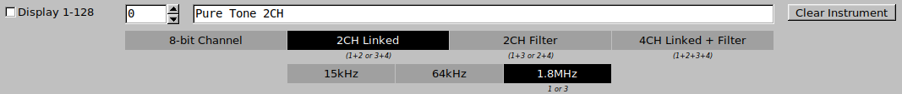

# PokeySynth

[](https://github.com/ivop/pokeysynth/actions/workflows/Linux%2064-bit.yml)
[](https://github.com/ivop/pokeysynth/actions/workflows/Windows%2064-bit.yml)

An LV2 Virtual Instrument that emulates the Atari Pokey soundchip.


A [short demonstration](https://youtu.be/UA6P4s_X4ds) on YouTube.

## Table of Contents

* [Installation](#installation)
* [Usage](#usage)
   * [Global Settings](#global-settings)
      * [MIDI Channels](#midi-channels)
      * [Pokey Channels](#pokey-channels)
      * [Update Speed](#update-speed)
   * [Instrument Editor](#instrument-editor)
      * [Name and Type](#name-and-type)
         * [Pokey Channel Combinations](#pokey-channel-combinations)
         * [Pokey Channel Clocks](#pokey-channel-clocks)
      * [Volume Envelope and Distortion](#volume-envelope-and-distortion)
         * [Volume](#volume)
         * [Distortion](#distortion)
      * [Note Table](#note-table)
      * [Miscellaneous Settings](#miscellaneous-settings)
         * [Filter Settings](#filter-settings)
         * [Frequency Continuous Controllers](#frequency-continuous-controllers)
      * [Loading and Saving](#loading-and-saving)
      * [SAP-R Recording](#sap-r-recording)
      * [Overdrive and Panic](#overdrive-and-panic)
    * [Theory of Operation](#theory-of-operation)
      * [Final Volume](#final-volume)
      * [Final Frequency](#final-frequency)
      * [Channel Priorities](#channel-priorities)
   * [Further Notes](#further-notes)
   * [Supported MIDI Events](#supported-midi-events)
      * [Channel Voice Messages](#channel-voice-messages)
      * [Control Change Messages](#control-change-messages)
      * [Channel Mode Messages](#channel-mode-messages)
   * [DAWs without LV2 support](#daws-without-lv2-support)
   * [Known Bugs](#known-bugs)
* [Development](#development)

## Installation

([🡑 table of contents](#table-of-contents))

Head over to the [Releases](https://github.com/ivop/pokeysynth/releases) page and download the latest release for your platform.

Linux users need to unpack the archive in ```$HOME/.lv2```, e.g. ```/home/john/.lv2```.
The .lv2 directory must be created if it does not already exist.
Windows users need to unpack the archive in ```%HOMEDRIVE%%HOMEPATH%\AppData\Roaming\LV2```, e.g. ```C:\Users\john\AppData\Roaming\LV2```.
The LV2 directory must be created if it does not already exist.

## Usage

([🡑 table of contents](#table-of-contents))

Once installed, you can load the plugin in your favorite DAW if it supports LV2 plugins, or in a stand-alone LV2 plugin host like ```jalv``` (Linux) or ```carla``` (Linux and Windows).
For details, see [below](#daws-without-lv2-support).

Each plugin instance emulates a full Pokey chip.
If your use case is creating chiptune-like music in combination with other synths and sampled instruments, it's advised to create as many plugin instances as you need channels and instruments, and play a single instrument on a single Pokey for maximum sound quality and frequency resolution.
If instead you want to create music that can actually be played back on real hardware (stock Atari with single Pokey, Gumby stereo upgrade, or quad Pokey with PokeyMax) you need to limit the amount of plugin instances accordingly and route up to four MIDI channels to each instance.
Some knowledge about how the Pokey chip operates is recommended, but not strictly necessary.

### Global Settings

#### MIDI Channels

([🡑 table of contents](#table-of-contents))


Each plugin instance can be configured to listen and respond to four blocks of MIDI channels (1-4, 5-8, 9-12, or 13-16).
This distinction is necessary if you want to eventually playback the result on real hardware.
The selected block of MIDI channels maps directly to the four Pokey channels.
So if you select 9-12, MIDI channel 9 will be played back on Pokey channel 1, MIDI channel 10 on Pokey channel 2, and so forth.

#### Pokey Channels

([🡑 table of contents](#table-of-contents))


When MIDI Note On events arrive, PokeySynth has to determine what to do with it.
If it's an event for a channel it is listening to, it's added to a list of which keys are currently being pressed on that channel.
Setting the channel to ```Monophonic``` will always play the highest note currently being on, and ignore all other notes.
For example, if you play a C major chord as G C E, it will play the E.
Setting the channel to ```Arpeggiate Up``` or ```Arpeggiate Down```, it will cycle through the note list either upwards or downwards, effectively playing an arpeggio.
The speed at which it steps through this list is determined by the ```Arp Speed``` slider.
It's directly related to the ```Update Speed``` (see below), and a higher number being slower.
The auto-arpeggiator works best if all Note On events arrive at the same time.
If you played the chords manually you might need to align them to the grid in your DAW.

#### Update Speed

([🡑 table of contents](#table-of-contents))


Update Speed controls the speed at which the incoming MIDI events are processed and played back as Pokey sounds.
It also determines how fast the sound generator(s) go through the volume envelope and distortion list (see below).
Each tick is one step.
50Hz is the most common setting and all instruments in the default sound bank are designed for it.

### Instrument Editor

([🡑 table of contents](#table-of-contents))

There are 128 instruments corresponding to the 128 MIDI program numbers.
Internally and in the MIDI protocol they are numbered from 0 to 127.
Some programs think they are clever and number them 1 to 128.
To make it easier in that case to lookup an instrument and set the program change event in your DAW, you can tick the Display 1-128 box.

#### Name and Type

([🡑 table of contents](#table-of-contents))



Each instrument has a name and a type.
The name can be up to 64 characters.
The types are any combination of channel layout and clock frequency.

##### Pokey Channel Combinations

([🡑 table of contents](#table-of-contents))

* An ```8-bit channel``` instrument uses a single Pokey channel and has a limited 8-bit frequency range.
* A ```2CH Linked``` instrument uses two 8-bit Pokey channels linked together to generate a single tone, and having a 16-bit frequency range.
For convenience, underneath the radio button there's a note displaying which Pokey channel combinations are used when such an instrument is triggered.
This type is most useful with an 1.8Mhz clock to have the widest frequency range.
* A ```2CH Filter``` instrument also utilizes two 8-bit Pokey channels, but filters one with the other, generating a different timbre than the normal square wave.
The frequency resolution is again limited to 8-bits, and underneath the button it displays which channel combinations it will use.
* Finally, a ```4CH Linked + Filter``` instrument uses all four 8-bit Pokey channels.
That's two pairs creating two ```2CH Linked``` instruments, and then one is filtered by the other, resulting in a single instrument with the same timbre as ```2CH Filter``` instruments, but with 16-bit frequency resolution.

When playing multiple instruments on multiple channels at once on a single plugin instance, there's a possibility of channel conflicts.
See **Channel Priorities** below how these are resolved.
In short, the instrument with the highest priority wins, and the lowest priority is muted.

##### Pokey Channel Clocks

([🡑 table of contents](#table-of-contents))

Each Pokey channel generates its sound frequency relative to a base clock.
The 15kHz and 64kHz clocks are mutually exclusive and influence all four Pokey channels.
1.8MHz overrides the 15 or 64kHz base clock, but can only be set for channel 1 or 3 (or channel 1+2 or 3+4 when the channels are linked).
Contrary to the channel layout conflicts mentioned earlier, frequency conflicts _do not_ mute the offending channel.
If two instruments are set to play at the same time (both are in the MIDI Note On phase) and there is a clock frequency mismatch, the 15kHz instrument wins (sounds in tune) and the 64kHz instrument will sound out of tune.
1.8MHz instruments never conflict, except when played on a channel that has no 1.8MHz support, i.e. playing an 8-bit 1.8MHz instrument on channel 2.
This is by design as to have audible feedback when combing 15kHz and 64kHz instruments on a single Pokey.
It is possible to mix 15kHz and 64kHz instruments on a single Pokey, but one has to take great care to avoid two mismatching instruments being played at the same time.

* 15kHz, low frequencies in the bass range, useful for bass lines and kick drums
* 64kHz, mid-range frequencies, used for chords, melodies, and percussive sounds
* 1.8MHz, overrides 15/64kHz base clock, full frequency range from C0-C9 when used in combinartion with ```2CH Linked```.

#### Volume Envelope and Distortion

([🡑 table of contents](#table-of-contents))


##### Volume

([🡑 table of contents](#table-of-contents))

The volume envelope describes how the volume of the instrument changes throught time.
Each tick (speed determined by the global ```Update Speed```) has a specific volume assigned.
You can either draw them as a bar graph, edit them manually in hexadecimal below it, or use the ADSR helper on the left.
Note that the ADSR values are _not_ real-time.
You need to set the values you want and then click one of the AD, ADR or ADSR buttons to generate the envelope.

* Attack sets the amount of ticks to rise from 0 to 15 (F in hexadecimal)
* Decay sets the amount of ticks to fall to sustain level
* Sustain sets the sustain level, i.e. the volume of the instrument while you keep pressing the key
* Release sets the amount of ticks to fall from sustain level to 0

Every MIDI Note On event starts at the beginning of the envelope.
When it reaches the marker of the ```Sustain End``` slider, it will loop back to the ```Sustain Start``` slider position.
Most of the time these are the same, sustaining on a constant volume when a note is held.
You could use a small window between Start and End to create a volume tremelo.
Once a MIDI Note Off event arrives, the Release period starts, which usually fades out the volume to 0.
If the ```Sustain End``` marker is equal to or beyond the ```Release End``` marker, there will be no sustain and it will progress linearly from start to end and then stop.
This is useful for percussion or pizzicato instruments which have no sustain.

##### Distortion

([🡑 table of contents](#table-of-contents))

The distortion list denotes which Pokey distortion is used while playing back the note.

* 0 - Pure, this is a pure square wave, used for instruments, and chords, or bass notes at 15kHz or with 2CH Linked instruments
* 1 - Noise, white noise generator, useful for percussion
* 2 - Buzzy Bass, the typical Pokey bass sound, with a soft edge
* 3 - Gritty Bass, the typical Pokey bass sound, but more harsh. Note that 15kHz and 1.8MHz 2CH Linked instruments have no gritty bass. Setting this type of distortion will fallback to buzzy bass.
* 4 - Poly5 Square, sort of a sqaure wave, but sounds more like a hobo or clarinet. Only useful for 1.8MHz 8-bit channel instruments.

On the right there are handy buttons to set the whole envelope to one of the specified distortions.

#### Note Table

([🡑 table of contents](#table-of-contents))


During sound generation, the note table is used to determine which frequency is played back.
PokeySynth steps through the table at its own speed, which is not necesarily the same as the envelope speed.
When it reaches the ```End``` marker as set by the slider at the bottom, it loops back to the ```Loop``` slider point.
If these are the same, it keeps repeating the last note type.
Some types take an argument, which is specified below the type designator, with the least significant byte on top, gradually descending to the most significant byte at the bottom.
Arguments are 32-bit values and specified in hexadecimal.

The following types are available:

* 0 - MIDI Note, the playback frequency is determined by the MIDI Note On event, i.e. MIDI Note Number 69 corresponds to A4 440Hz. PokeySynth will play 440Hz, or more accurately, as close as possible to 440Hz depending on the (base) clock of the instrument. This type takes no argument, and its value is ignored.
* 1 - MIDI +/- Note, same as 0, but the MIDI Note Number is adjusted with the argument value prior to conversion to hertz. This can be used to generate arpeggios instead of using the auto-arpeggiator.
* 2 - MIDI +/- Cents, same as 0, but after conversion to hertz the frequency is adjusted by an x amount of cents. For example, +100 cents is a semi-tone higher and will result in the same frequency as when type 1 was used with a +1 note argument. By quickly toggling between plus some cents and minus some cents, this is one of the two methods to create a vibrato (the other being MIDI ModWheel Continuous Control events).
* 3 - Fixed Divider, this places the argument value into the Pokey frequency divider register(s). This bypasses the MIDI Note Number and uses the 8-bit (```8-bit Channel```), 16-bit (```2CH Linked``` or ```2CH Filter```), or 32-bit (```4CH Linked + Filter```) value to directly set the frequency of the note being played. This mainly is useful to create percussion instruments.

When manually editing the hexadecimal values, be sure to sign extend negative numbers to 32-bit(!), especially for type 1 and 2.
Type 3 is less picky, as it just masks off the excess bits anyway if the channel layout of the instruments calls for a smaller value.

One can also use the handy chord generator on the left.
Similar to the ADSR helper before, this is _not_ a real-time chord arpeggiator.
You have to set the type of chord you want and press the ```Chord``` button.
It'll then generate the appropriate note table.
The chord type is divided in several sections.

* Base [triad](https://en.wikipedia.org/wiki/Triad_(music)), being [major](https://en.wikipedia.org/wiki/Major_chord), [minor](https://en.wikipedia.org/wiki/Minor_chord), [suspended second](https://en.wikipedia.org/wiki/Suspended_chord), [suspended fourth](https://en.wikipedia.org/wiki/Suspended_chord), [augmented](https://en.wikipedia.org/wiki/Augmented_triad) or [diminished](https://en.wikipedia.org/wiki/Diminished_triad). 
* Added note, which can be - (none), [dominant seventh](https://en.wikipedia.org/wiki/Seventh_chord), [major seventh](https://en.wikipedia.org/wiki/Major_seventh_chord), [ninth](https://en.wikipedia.org/wiki/Ninth_chord), [eleventh](https://en.wikipedia.org/wiki/Eleventh_chord) and [thirteenth](https://en.wikipedia.org/wiki/Thirteenth). Note that add9, add11, and add13 _only_ add the specific interval, i.e. Cadd9 is not the same as C9, where the latter would also include the 7th and possibly drop the 5th.
* [Inversion](https://en.wikipedia.org/wiki/Inversion_(music)), root, first, second, and third inversion, determines the lowest and highest note. For a triad, the third inversion is the same as the root inversion.
* Direction, up or down, set whether the arpeggio is played from the lowest to the highest note, or vice versa.

I tried to included the most common used triads and quads and still be not too overwhelming. If you want the Hendrix Chord (which is a [dominant seventh sharp ninth chord](https://en.wikipedia.org/wiki/Dominant_seventh_sharp_ninth_chord)) you need to edit the note table manually.

#### Miscellaneous Settings

([🡑 table of contents](#table-of-contents))


##### Filter Settings

([🡑 table of contents](#table-of-contents))

This influences the ```2CH Filter``` and ```4CH Linked + Filter``` instruments.
To create the filter effect, one of the two involved channels is playing a note slightly detuned relative to the base note that is being played.
```Filter Detune``` determines how many cents it is detuned.
Note that the consequence of changing this value is limited on 8-bit filtered instruments (```2CH Filter```).
To notice the full effect, you need to use a ```4CH Linked + Filter``` instrument.
The ```Filter Detune Volume``` determines the volume level of the detuned channel.
If this is non-zero, you'll hear a pure square wave alongside the filtered sound for a fuller sound.
When this is used, it's set to around 50% most of the time.
```Filter Transpose Octave Down``` does what its name says.
When checked, the note being played is transposed a full octave (i.e. twelve semitones) down.
If you switch a previously composed melody line from a ```Pure Tone``` instrument to a filtered instrument you might notice it appears to be an octave to high and/or sounds a little thin or out of tune.
This option is for that type of situations so you don't need to make any changes in your MIDI composition.

##### Frequency Continuous Controllers

([🡑 table of contents](#table-of-contents))

PokeySynth reacts to various frequency related MIDI CC events.

* PitchWheel. This shifts the note frequency up or down. Sadly, there is no standard that defines how the internal MIDI value (-8192 to 8192) is supposed to be mapped to cents. Most commonly, synthesizers use +/- 200 cents, meaning a full tone up or down when the pitchwheel is moved to either end of its range. Sometimes you want to go further. You can extend its range up to 1200 cents (one octave) in either direction.
* ModWheel. The modulation wheel changes the frequency based on a sine wave LFO (Low Frequency Oscillator). The ```LFO depth``` setting determines the amplitude of the sine wave in cents, and the ```LFO Speed``` determines how fast it modulates. The latter is set as degrees per frame. A full sine wave is 360 degrees, and one frame corresponds to one tick of the ```Update Speed```.

#### Loading and Saving

([🡑 table of contents](#table-of-contents))


Here you can load or save individual instruments, and load or save a full bank of 128 instruments.
You are entirely free to choose the filename you like, but as a convention I used ```.ins``` for instruments, and ```.bnk``` for sound banks.
```Export List``` lets you write a plain text list of all instrument names and numbers to file, which might be handy as a reference when you use a previously defined bank, so you do not constantly have to lookup MIDI Program Numbers when switching to the desired instrument.

#### SAP-R Recording

([🡑 table of contents](#table-of-contents))


Each PokeySynth instance is capable of writing a raw Pokey register dump to a file, which can later be played back at original hardware with the appropriate SAP-R player.
Recording can be started by pressing the ```Start``` button, and is stopped by pressing the ```Stop``` button.
Consecutive presses to ```Start``` will overwrite the previous recording if you don't change the filename in between, so be cautious.
As this might be cumbersome and tricky to time correctly (start playback in DAW, quickly start recording before music starts), and is even more clumsy when trying to record a stereo Pokey song (you cannot press two record buttons at once, so you have to manually synchronize the two SAP-R files with ```sapredit``` (part of [saprtools](https://github.com/ivop/saprtools)) afterwards), you can also automate this.
By strategically placing MIDI CC14 events on _one_ of the MIDI channels that is routed to a particular PokeySynth instance, you can either start or stop the SAP-R recording process.
CC14 takes a value argument. 64-127 starts recording, 0-63 stops recording.
This way you can easily record your stereo or quad pokey song and the resulting SAP-R files will automatically be in sync.

#### Overdrive and Panic!

([🡑 table of contents](#table-of-contents))


```Overdrive Compensation``` only is only relevant when more than one instrument is routed to the same plugin instance.
If the total volume of all instruments currently audible combined exceeds 40, the Pokey Chip starts to overdrive and the sound starts to clip and sounds badly.
Without having to adjust any of the other factors that determine the volume of each instrument (see Theory of Operation below), you can change the overdrive compensation value to reduce the overall volume without changing the relative dynamics between channels and instruments.
This is basically a master volume slider.
The maximum combined volume is directly related to its value.
For example, if it is set to 10, your volume envelope that ranges from 0-15 is linearly mapped to 0-10.

The ```Panic!``` button internally sends MIDI CC120 (All Notes Off) to all 16 channels, sets the ModWheel CC1 to 0, and the Volume CC7 to 127.
You will probably not use this often, but it can be handy when for example you switch MIDI send channel on your master keyboard while a key is being hold.
The Note Off event that's generated when the key is released will be sent on a different MIDI channel than on which the Note On event was sent, hence you'll have a hung note.
Or you switch off power of your keyboard while a key is being pressed, or your DAW crashes during playback with your PokeySynth instance being hosted externally.
Sometimes the ```Panic!``` button can be useful so you don't have to restart the plugin to get rid of hung notes.

### Theory of Operation

#### Final Volume

([🡑 table of contents](#table-of-contents))

The volume of a note is determined by the following parameters in this order:

* Volume is read from envelope table
* Overdrive Compensation, multiply by (value/15)
* MIDI CC7 Volume, multiply by (CC7 value/127)
* Note On Velocity, multiply by (velocity value/127)
* If it's a filtered instrument and it's the detuned channel, apply Filter Detune Volume percentage

All calculations are done with floating point math.
Rounding to the nearest integer suitable for storing in a Pokey register is done as the final step.

#### Final Frequency

([🡑 table of contents](#table-of-contents))

The frequency (clock divider) of a note is determined by the following parameters in this order:

* If note type from the note table is 3 (Fixed Divider), the value is read from the table and all the next steps are skipped
* The note is set by the Note Number of the MIDI Note On event
* If note type from the note table is 1, the argument from the note table is added (negative numbers result in subtraction)
* From this note number the corresponding frequency is calculated
* If note type from the note table is 2, the argument determines the frequency adjustment in cents. This adjustment is appplied.
* If the pitch wheel is not in its center position, the relevant pitch shift is applied.
* And finally, the pitch is adjusted accoring to the modulation wheel setting, taking into account its depth setting, mapping the MIDI event value ranging from -8192 to 8192 to the correct amount of cents.

#### Channel Priorities

([🡑 table of contents](#table-of-contents))

Channel priorities are handled according to the following table:

<table>
  <tr>
    <th colspan="1" align="center"> Priority </th>
    <th colspan="4" align="center"> Channel Configuration </th>
  </tr>
  <tr>
    <th colspan="1" align="center"> 1 </th>
    <td colspan="4" align="center"> 1+2+3+4 Linked Filtered </td>
  </tr>
  <tr>
    <th colspan="1" align="center"> 2 </th>
    <td colspan="2" align="center"> 1+3 Filtered </td>
    <td colspan="2" align="center"> 2+4 Filtered </td>
  </tr>
  <tr>
    <th colspan="1" align="center"> 3 </th>
    <td colspan="2" align="center"> 1+3 Filtered </td>
    <td colspan="1" align="center"> 2 Single </td>
    <td colspan="1" align="center"> 4 Single </td>
  </tr>
  <tr>
    <th colspan="1" align="center"> 4 </th>
    <td colspan="2" align="center"> 1+2 Linked </td>
    <td colspan="2" align="center"> 3+4 Linked </td>
  </tr>
  <tr>
    <th colspan="1" align="center"> 5 </th>
    <td colspan="2" align="center"> 1+2 Linked </td>
    <td colspan="1" align="center"> 3 Single </td>
    <td colspan="1" align="center"> 4 Single </td>
  </tr>
  <tr>
    <th colspan="1" align="center"> 6 </th>
    <td colspan="1" align="center"> 1 Single </td>
    <td colspan="2" align="center"> 2+4 Filtered </td>
    <td colspan="1" align="center"> 3 Single </td>
  </tr>
  <tr>
    <th colspan="1" align="center"> 7 </th>
    <td colspan="1" align="center"> 1 Single </td>
    <td colspan="1" align="center"> 2 Single </td>
    <td colspan="2" align="center"> 3+4 Linked </td>
  </tr>
  <tr>
    <th colspan="1" align="center"> 8 </th>
    <td colspan="1" align="center"> 1 Single </td>
    <td colspan="1" align="center"> 2 Single </td>
    <td colspan="1" align="center"> 3 Single </td>
    <td colspan="1" align="center"> 4 Single </td>
  </tr>
</table> 

This means that, for example, a single channel instrument on channel 1, 2, and 3,
and a filtered instrument on channel 4 is handled according to priority rule 6,
which means that channel 1 (single), 3 (single) and 2+4 (filtered) are audible and the single channel instrument
on channel 2 is muted.

### Further Notes

([🡑 table of contents](#table-of-contents))

* Linked and Filtered instruments can be played at any of the involved channels and will sound correct. For example, on a plugin instance that listens to 13-16, a filtered instrument (1+3 or 2+4) can be played on MIDI channel 13 or 15, resulting in the sound being played back utilizing Pokey channel 1 and 3, or on MIDI channel 14 or 16, resulting in the sound being played back using Pokey channel 2 and 4.
* There's a somewhat hidden **sawtooth** timbre. To use it, you have to create a ```2CH Filter``` instruments and set the clock to 1.8MHz (normally you would set it to 15 or 64). The sawtooth is only audible when this instrument is played back on Pokey channel 1 or 3 (the channels that get clocked at 1.8MHz) and won't work on channels 2 and 4 because you cannot clock them at 1.8MHz. This is a hardware limitation.
* For each timbre there's at least one example in the default sound bank. Instruments 0-45 are all 16-bit (linked) instruments or 32-bit (linked + filter), except for instrument 44, which is the 1.8MHz single channel (1 or 3) Poly5 square which is often used alongside. Instruments 64-107 are 8-bit and 16-bit (filter only) instruments. All instruments up to now run use the 64kHz base clock (or 1.8MHz override). Instruments 120-127 are a few 15kHz examples.
* The hexadecimal values can be manually edited. Use the cursor keys to navigate through each list, and the hexadecimal number keys to enter values (0-9, a-f, or A-F). Cursor navigation is limited to the list you are currently editing. To edit another list, you have to focus it first. You can also use the ```+``` and ```-``` keys to increase and decrease the number by one. Using this while editing the note table argument values, it acts on the whole signed 32-bit integer value and the sign bit is correctly extended.
* Focus follows the mouse cursor automatically. There is no need to click the specific UI item.
* The sliders can be adjusted with the mouse wheel. Move your mouse cursor over it to get automatic focus, and scroll the wheel up or down to modify its value.
* Using the mouse wheel in the instrument number field will scroll through all the available instruments.
* There are several ```Clear``` buttons. Each corresponds to the section to which it is closest, i.e. clear the envelope and distortion settings, clear the note table, or clear the miscellaneous settings. At the top right of the instrument editor there's a ```Clear Instrument``` button that clears them all at the same time.
* If you want a more in-depth description of how Pokey works internally and understand why PokeySynth has certain limitations, I recommend reading the Pokey section of the [Altirra Hardware Reference Manual](https://www.virtualdub.org/downloads/Altirra%20Hardware%20Reference%20Manual.pdf).
* At first, it might seem difficult to mix several instruments on a single Pokey channel, having to constantly insert Program Change MIDI events to switch to a different instrument, but it does not have to be that tedious. You can add a second MIDI DAW track that is connected to the same MIDI channel as your melody track, and is run through a Note to Program Change MIDI filter (for example [Note2PC](https://github.com/x42/midifilter.lv2)) before it gets routed to the PokeySynth plugin. So both DAW tracks output to the same MIDI channel, and eventually the same Pokey channel. One track sends notes, the other track sends program change events, but with the ease of use of just painting the PC events in your piano roll as notes, instead of manually editing true PC events.

### Supported MIDI Events

([🡑 table of contents](#table-of-contents))

#### Channel Voice Messages

* Note On, channel (0-15), note number (0-127) and velocity (0-127, controls the volume)
* Note Off, channel (0-15), note number (0-127)
* PitchBend, channel (0-15), amount (-8192 to 8192)
* Program Change, channel (0-15), program number (0 to 127)

#### Control Change Messages

* CC1 Modulation Wheel, amount (0-127)
* CC7 Channel Volume, level (0-127)
* CC14 Undefined, value (0-63 stop SAP-R recording, 64-127 start SAP-R recording)

#### Channel Mode Messages

* CC120 All Sound Off (PokeySynth implementation also resets all controllers)
* CC121 Reset All Controllers

### DAWs without LV2 support

If your DAW does not support LV2 plugins or its internal MIDI routing capabilities are limited, you can use an external LV2 plugin host.
For Linux there is ```jalv``` and ```carla```, both shipped with most common distros and easy to install via their package management system.
There's also a Windows port of the [Carla plugin host](https://kx.studio/Applications:Carla).

When using Carla on Windows, the easiest way is to copy the Carla.vst directory to the directory that is scanned for VST plugins by your DAW.
Refresh the list of plugins, and use the Carla patchbay VST plugin wrapper to load the PokeySynth LV2 plugin.
Note that you have to connect PokeySynth to Audio Out _within_ the Carla patchbay, or you won't have any sound.
See [known bugs](#known-bugs) for its current limitations, and a solution using Reaper as a host only for your favourite DAW.

### Known Bugs

([🡑 table of contents](#table-of-contents))

I recently discovered that the Windows version of Carla has problems redirecting keyboard events (the alphabetical one, not the musical one) to the UI. Mouse events work fine, but up to 90% of
the keyboard events seem to get lost.
You can still run it perfectly fine as an audio backend, but the instrument editor might be hard to navigate without keyboard input. For one, you cannot conveniently give your instrument a new name. Windows Reaper does not have this problem when it's acting as plugin host, and neither has Carla for Linux. The Windows port of Carla is buggy in this respect.

###### Using Reaper as an LV2 host only

Until that's fixed upstream, and you want to use a Windows DAW that is not Reaper, and that does not have native LV2 support, it's advised to install Reaper anyway (it's free, as in WinRAR), but only use it as an LV2 host. That means, route all your DAWs MIDI output to Reaper, for example by using [loopMIDI](https://www.tobias-erichsen.de/software/loopmidi.html). First create a loopMIDI port. Start Reaper, and select 'Insert virtual instrument on new track' from the track menu. The default is that it listens to all incoming MIDI ports, including the just created loopMIDI Port. Now in your prefered DAW, you select the loopMIDI Port as your MIDI Out device, and that's it! Tested with FL Studio, but should work with any other DAW, too.

## Development

### Compiling From Source

([🡑 table of contents](#table-of-contents))

To compile PokeySynth from source you need to install the LV2 development package of your distribution as well as the FLTK development package of at least version 1.3.
For Windows I used MSYS and installed the same packages.
You also need a C++ compiler. Type ```make``` to build the plugin.
The binary result will be in the pokeysynth.lv2 directory.
The Windows DLL has all of its dependencies statically linked, except for the system DLLs.
The Linux library also links LV2 and FLTK statically, but depends on libX11 and friends, libz, libfreetype and libpng.
Release files should be compatible with Debian 12, Ubuntu 22.04 LTS and Linux Mint 21.

### Why LV2?

([🡑 table of contents](#table-of-contents))

The world of audio plugins turned out to be a real challenge.
One would think things got standardized years ago across Windows, Linux, and macOS, but no such thing has happened.
Developing a cross-platform plugin that compiles more or less from the same source tree is not an easy feat.
I briefly looked into JUCE, which supposedly creates wrappers around it for all major plugin formats (VST2/3, AU, AUv3, and LV2, no CLAP), but I soon encountered problems with sending large amounts of data between the plugin and the UI. Also, I needed to learn a completely new toolkit, and they dropped support for their GUI builder years ago.
AU and AUv3 is macOS only, so that's a no-go.
VST2 has licensing issues, and VST3 is not widely supported on Linux, which is a must-have platform for me.
CLAP is a fairly recent addition, adding [yet another "standard"](https://xkcd.com/927/) (xkcd), and again, Linux support is scarce.
Then there's DSSI, which once seemed promising, but is now completely dead.

That leaves us with LV2, the succesor to LADSPA2. Supported by at least QTractor, Ardour, and Reaper on Linux, and Ardour, and Reaper on Windows. Can be hosted externally with jalv on Linux, and Carla on both Linux and Windows, which basically opens up all the other DAWs, like Rosegarden (has native LV2 support in development version, but it's buggy and internal MIDI routing is non-existant), LMMS, BitWig, RipX, Cubase, ProTools, Cakewalk, et cetera.
In theory it should even work with Ardour and Reaper on macOS.

### Why FLTK?

([🡑 table of contents](#table-of-contents))

Now the GUI part of the plugin is another kind of mess.
LV2 supports native X11, Windows and Cocoa UIs. But writing one limits it to that specific platform, so that's out of the question.
For cross-platform UIs, it defines GTK and Qt UI types in its standard, but that turns out to be a huge mistake.
If your interface is GTK+ 2 and the host uses GTK+ 3, or it's the other way around, that won't work as the GTK eventloop of one version is not compatible with that of the other.
The same happens with Qt 5 and 6. It's hopeless.
Then there are some LV2 specific UI libraries. Most of them build on top of an X11UI type, so that's Linux only. Even the ones that build on top of GLFW, which should be a cross-platform OpenGL abstraction layer, need to reparent their main window to the plugin host supplied window (an X11 Window on Linux, a HWND on Windows, or an NSView on macOS), which again introduces platform dependent code, and all the examples only show X11UI reparenting.
Besides, all of the LV2 specific UI libraries were started years ago, and show no activity for the last three or so years, so that's not really future proof.

Soooo, that's when I decided to use FLTK. It is a small, easy to use C++ toolkit, that has been around for over 25 years, and has a bright future. It does have a bit dated nineties look, but it does the job.
Platform specific code has been reduced to the bare minimum for reparenting an X11 Window and a Windows HWND to the host window, which is less than 15 lines of code each.
A macOS version is theoretically possible. The audio part compiles cleanly with brew and XCode, but the UI part is troublesome. It _should_ be possible to reparent an NSView, but I can't find any decent sample code and there is little documentation by Apple, of which all is Objective-C anyway, and not C++. It should be possible to do a few function calls from C++, right? It also doesn't help that I don't own a Mac, and I have no sound running under emulation. Any help here is appreciated.

So, there it is, LV2 with FLTK.

### Credits

([🡑 table of contents](#table-of-contents))

PokeySynth is Copyright © 2024, 2025, by Ivo van Poorten, and is licensed under the terms of the General Public License, version 2.  
Pokey emulation engine is Copyright © 2002-2018 by Michael Borisov, Krzystof Nikiel, Perry McFarlane, Petr Stehlík, and Piotr Fusik, and is licensed under the terms of the General Public License, version 2, or at your option any later version.  
Remez resampling code is Copyright © 1995,1998 by Jake Janovetz, and Copyright © 2003-2008 by Krzysztof Nikiel, Piotr Fusik, and Perry McFarland, and is licensed under the terms of the General Public License, version 2, or at your option any later version.  
