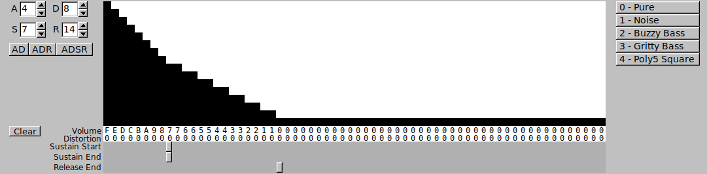

# PokeySynth

An LV2 Virtual Instrument that emulates the Atari Pokey soundchip.


## Installation

Head over to the [Releases](https://github.com/ivop/pokeysynth/releases) page and download the latest release for your platform.

Linux users need to unpack the archive in ```$HOME/.lv2```.
The .lv2 directory must be created if it does not already exist.
Windows users need to unpack the archive in ```%HOMEDRIVE%%HOMEPATH%\AppData\Roaming\LV2```.
The LV2 directory must be created if it does not already exist.

## Usage

Once installed, you can load the plugin in your favorite DAW if it supports LV2 plugins, or in a stand-alone LV2 plugin host like ```jalv``` (Linux) or ```carla``` (Linux and Windows).
Each plugin instance emulates a full Pokey chip.
If your use case is creating chiptune-like music in combination with other synths and sampled instruments, it's advised to create as many plugin instances as you need channels and instruments, and play a single instrument on a single Pokey for maximum sound quality and frequency resolution.
If instead you want to create music that can actually be played back on real hardware (stock Atari with single Pokey, Gumby stereo upgrade, or quad Pokey with PokeyMax) you need to limit the amount of plugin instances accordingly and route up to four MIDI channels to each instance.
Some knowledge about how the Pokey chip operates is recommended, but not strictly necessary.

#### MIDI Channels


Each plugin instance can be configured to listen and respond to four blocks of MIDI channels (1-4, 5-8, 9-12, or 13-16).
This distinction is necessary if you want to eventually playback the result on real hardware.
The selected block of MIDI channels maps directly to the four Pokey channels.
So if you select 9-12, MIDI channel 9 will be played back on Pokey channel 1, MIDI channel 10 on Pokey channel 2, and so forth.

#### Pokey Channels


There are 128 instruments corresponding to the 128 MIDI program numbers.
Internally and in the MIDI protocol they are numbered from 0 to 127.
Some programs think they are clever and number them 1 to 128.
To make it easier in that case to lookup an instrument and set the program change event in your DAW, you can tick the Display 1-128 box.

#### Update Speed


Update Speed controls the speed at which the incoming MIDI events are processed and played back as Pokey sounds.
It also determines how fast the sound generator(s) go through the volume envelope and distortion list (see below).
Each tick is one step.
50Hz is the most common setting and all instruments in the default sound bank are designed for it.

### Instrument Editor

#### Name and Type


Each instrument has a name and a type.
The name can be up to 64 characters.
The types are any combination of channel layout and clock frequency.

##### Pokey Channel combinations

* An ```8-bit channel``` instrument uses a single Pokey channel and has a limited 8-bit frequency range.
* A ```2CH Linked``` instrument uses two 8-bit Pokey channels linked together to generate a single tone, and having a 16-bit frequency range.
For convenience, underneath the radio button there's a note displaying which Pokey channel combinations are used when such an instrument is triggered.
This type is most useful with an 1.8Mhz clock to have the widest frequency range.
With lower clocks it only extends the resolution, not the range.
* A ```2CH Filter``` instrument also utilizes two 8-bit Pokey channels, but filters one with the other, generating a different timbre than the normal square wave.
The frequency resolution is again limited to 8-bits.
Again, underneath it displays which channel combinations are used.
* Finally, a ```4CH Linked + Filter``` instrument uses all four 8-bit Pokey channels.
That's two pairs creating two ```2CH Linked``` instruments, and then one is filtered by the other, resulting in a single instrument with the same timbre as ```2CH Linked``` instruments, but with 16-bit frequency resolution.

When playing multiple notes at once on a single plugin instance, there's a possibility of channel conflicts.
See **Channel Priorities** below how these are resolved.
In short, the instrument with the highest priority wins, and the lowest priority is muted.

##### Pokey Channel Clocks

Each Pokey channel generates its sound frequency relative to a base clock.
The 15kHz and 64kHz are mutually exclusive and influence all four Pokey channels.
1.8MHz overrides the 15 or 64kHz base clock, but can only be set for channel 1 or 3 (or channel 1+2 or 3+4 when the channels are linked).
Contrary to the channel layout conflicts mentioned earlier, frequency conflicts _do not_ mute the offending channel.
If two instruments are set to play at the same time (both are in the MIDI Note On phase) and there is a clock frequency mismatch, the 15kHz instrument wins (sounds in tune) and the 64kHz instrument will sound out of tune.
1.8MHz instruments never conflict, except when played on a channel that has no 1.8MHz support, i.e. playing an 8-bit 1.8MHz instrument on channel 2.
This is by design as to have audible feedback when combing 15kHz and 64kHz instruments on a single Pokey.
It is possible to mix 15kHz and 64kHz instruments on a single Pokey, but one has to take great care to avoid two mismatching instruments being played at the same time.

* 15kHz, low frequencies in the bass range, useful for bass lines and kick drums
* 64kHz, mid-range frequencies, used for chords, melodies, and percussive sounds
* 1.8MHz, overrides 15/64kHz base clock, full frequency range from C0-C9

#### Volume Envelope and Distortion



##### Volume

The volume envelope describes how the volume of the instrument changes throught time.
Each tick has a specific volume assigned.
You can either draw them as a bar graph, edit them manually in hexadecimal below it, or use the ADSR helper on the left.
Note that the ADSR values are _not_ real-time.
You need to set the values you want and then click one of the AD, ADR or ADSR buttons to generate the envelope.

* Attack sets the amount of ticks to rise from 0 to 15 (F)
* Decay sets the amount of ticks to fall to sustain level
* Sustain sets the sustain level, i.e. the volume of the instrument while you keep pressing the key
* Release sets the amount of ticks to fall from sustain level to 0

Every MIDI Note On event starts at the beginning of the envelope.
When it reaches the marker of the ```Sustain End``` slider, it will loop back to the ```Sustain Start``` slider.
Most of the time these are the same, sustaining on a constant volume when a note is held.
You can use a small window between Start and End to create a volume tremelo.
Once a MIDI Note Off event arrives, the Release period starts, which usually fades out the volume to 0.
If the ```Sustain End``` marker is equal to or beyond the ```Release End``` marker, there will be no sustain and it will progress linearly from start to end and then stop.
This is useful for percussion or pizzicato instruments which have no sustain.

##### Distortion

The distortion list denotes which Pokey distortion is used while playing back the note.

* 0 - Pure, this is a pure square wave, used for instruments, and chords, or bass notes at 15kHz or with 2CH Linked instruments
* 1 - Noise, white noise generator, useful for percussion
* 2 - Buzzy Bass, the typical Pokey bass sound, with a soft edge
* 3 - Gritty Bass, the typical Pokey bass sound, but more harsh. Note that 15kHz and 1.8MHz 2CH Linked instruments have no Gritty bass. Setting this type of distortion will fallback to buzzy bass.
* 4 - Poly5 Square, sort of a sqaure wave, but sounds more like a hobo or clarinet. Only useful for 1.8MHz 8-bit channel instruments.

On the right there are handy buttons to set the whole envelope to one of the specified distortions.

#### Note Table


During sound generation, the note table is used to determine which frequency is played back.
PokeySynth steps through the table at its own speed, which is not necesarily the same as the envelope speed.
When it reaches the ```End``` marker as set by the slider at the bottom, it loops back to the ```loop``` slider point.
If these are the same, it keeps repeating the last note type.
Some types take an argument, which is specified below the type designator, with the least significant byte on top, gradually descending to the most significant byte at the bottom.
Arguments are 32-bit values and specified in hexadecimal.

The following types are available:

* 0 - MIDI Note, the playback frequency is determined by the MIDI Note On event, i.e. MIDI Note Number 69 corresponds to A4 440Hz. PokeySynth will play 440Hz, or more accurately, as close as possible to 440Hz depending on the (base) clock of the instrument. This type takes no argument, and its value is ignored.
* 1 - MIDI +/- Note, same as 0, but the MIDI Note Number is adjusted with the argument value prior to conversion to hertz. This can be used to generate ar
* 2 - MIDI +/- Cents, same as 0, but after conversion to hertz the frequency is adjusted by an x amount of cents. +100 cents is a semi-tone higher and will result in the same frequency as when type 1 was used with a +1 note argument. By quickly toggling between plus some cents and minus some cents, this is one of the two methods to create a vibrato (the other being MIDI ModWheel Continuous Control events).
* 3 - Fixed Divider, this places the argument value into the Pokey frequency divider register(s). This bypasses the MIDI Note Number and uses the 8-bit (```8-bit Channel```), 16-bit (```2CH Linked``` or ```2CH Filter```), or 32-bit (```4CH Linked + Filter```) value to directly set the frequency of the note being played. This mainly is useful to create percussion instruments.

When manually editing the hexadecimal values, be sure to sign extend negative numbers to 32-bit(!), especially for type 1 and 2.
Type 3 is less picky, as it just masks off the excess bits anyway if the channel layout of the instruments calls for a smaller value.

One can also use the handy chord generator on the left.
Similar to the ADSR helper before, this is _not_ a real-time chord arpeggiator.
You have to set the type of chord you want and press the ```Chord``` button.
It'll then generate the appropriate note table.
The chord type is divided in several sections.

* Base triad, being major, minor, suspended second, suspended fourth, augmented or dimninished. 
* Added note, which can be - (none), flat seventh, major seventh, ninth, eleventh and thirteenth.
* Inversion, root, first, second, and third inversion, determines the lowest and highest note. For a triad, the third inversion is the same as the root inversion.
* Direction, up or down, set whether the arpeggio is played from the lowest to the highest note, or vice versa.

#### Miscellaneous Settings


##### Filter Settings

This influences the ```2CH Filter``` and ```4CH Linked + Filter``` instruments.
To create the filter effect, one of the two involved channels is playing a note slightly detuned relative to the base note that is being played.
```Filter Detune``` determines how many cents it is detuned.
The ```Filter Detune Volume``` determines the volume level of the detuned channel.
If this is non-zero, you'll hear a pure square wave alongside the filtered sound for a fuller sound.
When this is used, it's set to around 50% most of the time.
```Filter Transpose Octave Down``` does whet its name says.
When checked, the note being played is transposed a full octave (i.e. twelve semitones) down.
If you switch a previously composed melody line from ```Pure Tone``` to a filtered instruments you might notice it appears to be an octave to high and/or sounds a little thin or out of tune.
This option is for that type of situations.

##### Frequency Continuous Controllers

PokeySynth reacts to various frequency related MIDI CC events.

* PitchWheel. This shifts the note frequency up or down. Sadly, there is no standard that defines how the internal value maps cents. Most commonly, synthesizers use +/- 200 cents, meaning a full tone up or down when the pitchwheel is moved to either end of its range. Sometimes you want to go further. You can extend its range up to 1200 cents (one octave) in either direction.
* ModWheel. The modulation wheel changes the frequency based on a sine wave LFO (Low Frequency Oscillator). The ```LFO depth``` setting determines the amplitude of the sine wave in cents, and the ```LFO Speed``` determines how fast it modulates. The latter is set as degrees per frame. A full sine wave is 360 degrees, and one frame corresponds to one tick of the ```Update Speed```.

#### Loading and Saving


Here you can load or save individual instruments, and load or save a full bank of 128 instruments.
You are entirely free to choose the filename you like, but as a convention I used ```.ins``` for instruments, and ```.bnk``` for sound banks.
```Export List``` lets you write a plain text list of all instrument names and numbers to file, which might be handy as a reference when you use a previously defined bank, so you do not constantly have to lookup MIDI Program Numbers when switching to the desired instrument.

#### SAP-R Recording


Each PokeySynth instance is capable of writing a raw Pokey register dump to a file, which can later be played back at original hardware with the appropriate SAP-R player.
Recording can be started by pressing the ```Start``` button, and is stopped by pressing the ```Stop``` button.
Consecutive presses to ```Start``` will overwrite the previous recording, so be cautious.
As this might be cumbersome and tricky to time correctly (start playback in DAW, quickly start recording before music starts), and is even more clumsy when trying to record a stereo Pokey song (you cannot press two record buttons at once, so you have to manually synchronize the two SAP-R files with ```sapredit``` (part of [saprtools](https://github.com/ivop/saprtools)) afterwards), you can also automate this.
By strategically placing a MIDI CC14 events on _one_ of the MIDI channels that is routed to a particular PokeySynth instance, you can either start or stop the SAP-R recording process.
CC14 takes a value argument. 0-63 starts recording, 64-127 stops recording.
This way you can easily record your stereo or quad pokey song and the resulting SAP-R files will automatically be in sync.

#### Overdrive and Panic!


```Overdrive Compensation``` only applies when more than one instrument is routed to the same plugin instance.
If the total volume of all instruments currently audible combined exceeds 40, the Pokey Chip starts to overdrive and the sound starts to clip and sounds badly.
Without having to adjust any of the other factors that determine the volume of each instrument (see Theory of Operation below), you can change the overdrive compensation value to reduce the overall volume without changing the relative dynamics between channels and instruments.
This is basically a master volume slider.
The maximum combined volume is directly related to its value.
For example, if it is set to 10, your volume envelope that ranges from 0-15 is linearly mapped to 0-10.

The ```Panic!``` button internally sends MIDI CC120 (All Notes Off) to all 16 channels, sets the ModWheel CC1 to 0, and the Volume CC7 to 127.
You will probably not use this often, but it can be handy when for example you switch MIDI send channel on your master keyboard while a key is being hold.
The Note Off event that's generated when the key is released will be sent on a different MIDI channel than on which the Note On event was sent, hence you'll have a hung note.
Or you switch off power of your keyboard while a key is being pressed, or your DAW crashes during playback with your PokeySynth instance being hosted externally.
Sometimes the ```Panic!``` button can be useful so you don't have to restart the plugin to get rid of hung notes.

### Theory of Operation

#### Volume

The volume of a note is determined by the following parameters in this order:

* Volume from envelope
* Overdrive Compensation, multiply by (ODC/15)
* MIDI CC7 Volume as factor, multiply by (CC7 value/127)
* Note On Velocity, multiply by (velocity value/127)
* If it's a filtered instrument and it's the detuned channel, apply Filter Detune Volume percentage

#### Frequency

The frequency (divider) of a note is determined by the following parameters in this order:

* If note type from the note table is 3 (Fixed Divider), the value is read from the table and all the next steps are skipped
* The note is set by the Note Number of the MIDI Note On event
* If note type from the note table is 1, the argument from the note table is added (negative numbers result in subtraction)
* From this note number the corresponding frequency is calculated
* If note type from the note table is 2, the argument determines the frequency adjustment in cents. This adjustment is appplied.
* If the pitch wheel is not in its center position, the relevant pitch shift is applied.
* And finally, the pitch is adjusted accoring to the modulation wheel setting, taking into account its depth setting, mapping the MIDI event value ranging from -8192 to 8192 to the correct amount of cents.

#### Channel Priorities

Channel priorities are handled according to the following table:

<table>
  <tr>
    <th colspan="1" align="center"> Priority </th>
    <th colspan="4" align="center"> Channel Configuration </th>
  </tr>
  <tr>
    <th colspan="1" align="center"> 1 </th>
    <td colspan="4" align="center"> 1+2+3+4 Linked Filtered </td>
  </tr>
  <tr>
    <th colspan="1" align="center"> 2 </th>
    <td colspan="2" align="center"> 1+3 Filtered </td>
    <td colspan="2" align="center"> 2+4 Filtered </td>
  </tr>
  <tr>
    <th colspan="1" align="center"> 3 </th>
    <td colspan="2" align="center"> 1+3 Filtered </td>
    <td colspan="1" align="center"> 2 Single </td>
    <td colspan="1" align="center"> 4 Single </td>
  </tr>
  <tr>
    <th colspan="1" align="center"> 4 </th>
    <td colspan="2" align="center"> 1+2 Linked </td>
    <td colspan="2" align="center"> 3+4 Linked </td>
  </tr>
  <tr>
    <th colspan="1" align="center"> 5 </th>
    <td colspan="2" align="center"> 1+2 Linked </td>
    <td colspan="1" align="center"> 3 Single </td>
    <td colspan="1" align="center"> 4 Single </td>
  </tr>
  <tr>
    <th colspan="1" align="center"> 6 </th>
    <td colspan="1" align="center"> 1 Single </td>
    <td colspan="2" align="center"> 2+4 Filtered </td>
    <td colspan="1" align="center"> 3 Single </td>
  </tr>
  <tr>
    <th colspan="1" align="center"> 7 </th>
    <td colspan="1" align="center"> 1 Single </td>
    <td colspan="1" align="center"> 2 Single </td>
    <td colspan="2" align="center"> 3+4 Linked </td>
  </tr>
  <tr>
    <th colspan="1" align="center"> 8 </th>
    <td colspan="1" align="center"> 1 Single </td>
    <td colspan="1" align="center"> 2 Single </td>
    <td colspan="1" align="center"> 3 Single </td>
    <td colspan="1" align="center"> 4 Single </td>
  </tr>
</table> 

This means that, for example, a single channel instrument on channel 1, 2, and 3,
and a filtered instrument on channel 4 is handled according to priority rule 6,
which means that channel 1, 3 and 2+4 filtered are audible and the single instrument
on channel 2 is muted.
