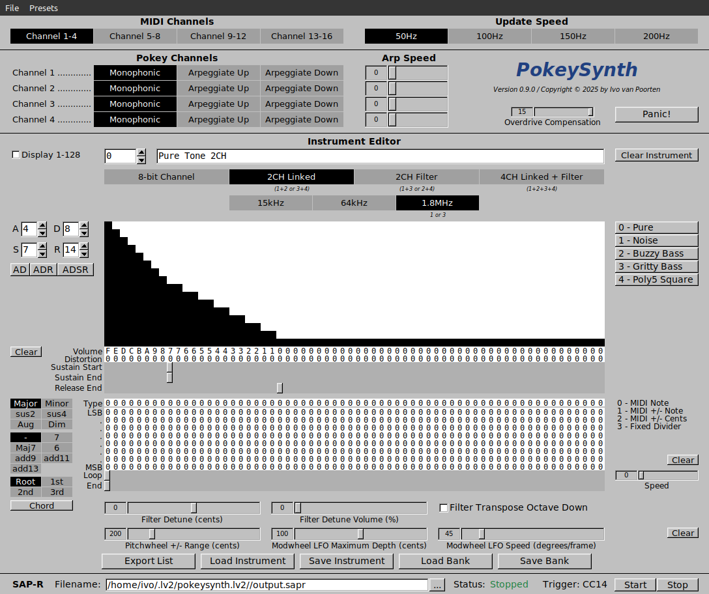

# PokeySynth

An LV2 Virtual Instrument that emulates the Atari Pokey soundchip.

* Channel Priorities

<table>
  
  <tr>
    <td colspan="4" align="center"> 1+2+3+4 Linked Filtered </td>
  </tr>
  <tr>
    <td colspan="2" align="center"> 1+3 Filtered </td>
    <td colspan="2" align="center"> 2+4 Filtered </td>
  </tr>
  <tr>
    <td colspan="2" align="center"> 1+3 Filtered </td>
    <td colspan="1" align="center"> 2 Single </td>
    <td colspan="1" align="center"> 4 Single </td>
  </tr>
  <tr>
    <td colspan="2" align="center"> 1+2 Linked </td>
    <td colspan="2" align="center"> 3+4 Linked </td>
  </tr>
  <tr>
    <td colspan="2" align="center"> 1+2 Linked </td>
    <td colspan="1" align="center"> 3 Single </td>
    <td colspan="1" align="center"> 4 Single </td>
  </tr>
  <tr>
    <td colspan="1" align="center"> 1 Single </td>
    <td colspan="2" align="center"> 2+4 Filtered </td>
    <td colspan="1" align="center"> 3 Single </td>
  </tr>
  <tr>
    <td colspan="1" align="center"> 1 Single </td>
    <td colspan="1" align="center"> 2 Single </td>
    <td colspan="2" align="center"> 3+4 Linked </td>
  </tr>
  <tr>
    <td colspan="1" align="center"> 1 Single </td>
    <td colspan="1" align="center"> 2 Single </td>
    <td colspan="1" align="center"> 3 Single </td>
    <td colspan="1" align="center"> 4 Single </td>
  </tr>
</table> 
